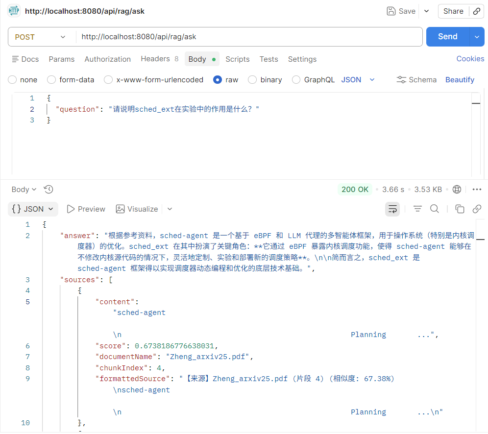

# RAG 知识库系统 - Spring AI + PGVector

基于 Spring AI、PGVector、Ollama 和 DeepSeek 构建的 RAG（检索增强生成）知识库系统。

## 📋 项目简介

本项目是一个完整的 RAG（检索增强生成）知识库系统，支持上传多种格式的文档，通过向量检索 + 大语言模型实现智能问答。系统具备多轮对话记忆、文档管理、来源溯源等核心功能。

## ✨ 功能特性

- 📄 **多格式文档支持**：PDF、Word（DOCX）、TXT、Markdown
- 🔍 **智能检索**：基于向量相似度检索相关文档片段
- 💬 **RAG 问答**：基于检索结果生成高质量回答
- 🧠 **多轮对话记忆**：基于 Redis 的会话历史管理
- 📚 **文档管理**：上传、列表、详情、删除、清空
- 📊 **来源追溯**：返回答案的引用来源和相似度分数
- 🚀 **高性能**：使用 PGVector 向量索引，毫秒级检索
- 📝 **完善日志**：AOP 切面记录请求耗时，便于监控
- 🛡️ **健壮性**： 统一异常处理、参数校验、操作日志

## 🛠️ 技术栈
| 组件    | 技术                                      |
|-------|-----------------------------------------|
| 框架    | Spring Boot 3.5.13 + Spring AI 1.0.0-M6 |
| 向量数据库 | PostgreSQL 16 + PGVector                |
| 向量化模型 | Ollama + nomic-embed-text               |
| 对话模型  | DeepSeek API                            |
| 对话存储 | Redis                                   |
| 文档解析 | PDFBox + Apache POI                     |
| 构建工具  | Maven                                   |
| 容器化   | Docker                                  |

## 📋 环境要求

- Java 17+
- Docker Desktop
- Ollama（本地安装）
- DeepSeek API Key

## 🚀 快速开始

### 1. 克隆项目
```bash
git clone https://github.com/你的用户名/rag-spring-ai-pgvector.git
cd rag-spring-ai-pgvector
```

### 2. 启动依赖服务
```bash
# 启动 PostgreSQL + pgvector
docker run --name pgvector -e POSTGRES_PASSWORD=123456 -p 5432:5432 -d pgvector/pgvector:pg16

# 启动 Redis
docker run --name redis -p 6379:6379 -d redis:alpine

# 启动 Ollama 并拉取 Embedding 模型
ollama pull nomic-embed-text
```

### 3. 配置 API Key
在 src/main/resources/application.yml 中配置 DeepSeek API Key：
```yaml
spring:
  ai:
    openai:
      api-key: ${DEEPSEEK_API_KEY}
```
或者环境变量：
```bash
export DEEPSEEK_API_KEY=your-api-key
```

### 4. 运行项目
```bash
mvn spring-boot:run
```

## 📡 API 接口文档
基础地址
```text
http://localhost:8080/api/rag
```
### 1.健康检查
#### GET /health
响应示例：
```json
"RAG Service is running!"
```

### 2. 上传文档
#### POST /upload

|参数	|类型	|说明|
|-------|-------|----|
|file	|MultipartFile	|支持 PDF/DOCX/TXT/MD|
响应示例：
```json
"文档处理完成！文件: 专利.docx, 类型: Word, 原始页数: 10, 分块数: 19, 耗时: 2566ms"
```

### 3. RAG 问答
#### POST /ask

请求体：
```json
{
"question": "这篇文章主要讲了什么？",
"sessionId": "可选，用于多轮对话",
"includeHistory": true
}
```
响应示例：
```json
{
  "answer": "这篇文章介绍了...",
  "sources": [
    {
      "content": "原文片段...",
      "score": 0.85,
      "documentName": "专利.docx",
      "chunkIndex": 0
    }
  ],
  "elapsedMs": 1234,
  "sessionId": "550e8400-e29b-41d4-a716-446655440000",
  "historyCount": 2
}
```
### 4. 文档管理
   - 获取文档列表
   #### GET /documents

响应示例：
```json
[
{
"fileName": "专利.docx",
"chunkCount": 19,
"uploadTime": 1743849622000,
"fileSize": 399098,
"fileType": "Word",
"formattedFileSize": "389.74 KB",
"formattedUploadTime": "2026-04-05 11:40:22"
}
]
```

- 获取文档详情
#### GET /documents/{fileName}

- 获取文档片段
#### GET /documents/{fileName}/chunks?limit=10

- 删除文档
#### DELETE /documents/{fileName}

- 清空所有文档
#### DELETE /documents

### 5. 对话历史管理
   - 获取会话历史
   #### GET /history/{sessionId}

响应示例：
```json
[
{
"role": "user",
"content": "什么是 RAG？",
"timestamp": "2026-04-05 11:41:25"
},
{
"role": "assistant",
"content": "RAG 是检索增强生成...",
"timestamp": "2026-04-05 11:41:31"
}
]
```

- 获取历史消息数量
#### GET /history/{sessionId}/count

- 检查会话是否存在
#### GET /history/{sessionId}/exists

- 清空会话历史
#### DELETE /history/{sessionId}

## 📁 项目结构
```text
src/main/java/com/demo/rag_demo/
├── controller/      # API 控制器
├── service/         # 业务逻辑
├── dto/             # 数据传输对象
├── exception/       # 全局异常处理
├── aspect/          # AOP 日志切面
└── config/          # 配置类
```

## ⚙️ 配置说明
主要配置项（application.yml）：
```yaml
spring:
  ai:
    ollama:
      base-url: http://localhost:11434
      embedding:
        model: nomic-embed-text
    
    openai:
      base-url: https://api.deepseek.com
      chat:
        options:
          model: deepseek-chat
    
    vectorstore:
      pgvector:
        dimensions: 768
        index-type: HNSW
        distance-type: COSINE_DISTANCE
    data:
      redis:
        host: localhost
        port: 6379

    server:
      port: 8080
```

## 📊 效果展示
### 问答示例


## 🔧 常见问题
### Q: 上传文档后提问返回"未找到相关内容"？
A: 检查以下几点：
 - 确保 Ollama 正在运行：ollama list
 - 确认 Embedding 模型已下载：ollama pull nomic-embed-text
 - 降低相似度阈值（application.yml 中的 threshold）

### Q: Redis 连接失败？
A: 启动 Redis 容器：docker run --name redis -p 6379:6379 -d redis:alpine

### Q: 多轮对话不生效？
A: 确保第二轮请求携带了第一轮返回的 sessionId


## 🤝 贡献
欢迎提交 Issue 和 Pull Request。

## 📄 License
MIT License